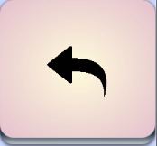

# SoftwareMaintenanceGrp5

# Diamond Hunter & MapViewer

This repository contains both projects: Diamond Hunter, which is the main original game, and MapViewer, which is a standalone Map Editor for the main game with the functionality to change the player usable items(Axe and Boat) location.

Both of the application are built into `.jar` files and placed into the [bin/](bin/) folder.

## Diamond Hunter

### Running Diamond Hunter

To run Diamond Hunter, open and start up [Diamond-Hunter.jar](bin/Diamond-Hunter.jar) and the game should be launched.

Windows user might encounter a problem with directly running [Diamond-Hunter.jar](bin/Diamond-Hunter.jar), normally with the game getting stuck at the menu. In that case, open up your command prompt(`cmd`), and make sure your current directory contains the Jar file (default location of the jar files will be in [bin/Diamond-Hunter.jar](bin/Diamond-Hunter.jar)), then type in the command `java -jar Diamond-Hunter.jar` in the command prompt to run it instead.

If you are running Diamond Hunter from the source code, simply run [com.neet.DiamondHunter.Main.Game.main()](src/com/neet/DiamondHunter/Main/Game.java) to start the application.

## MapViewer

### Running MapViewer

To run MapViewer, open and start up [MapViewer.jar](bin/MapViewer.jar) and the game should be launched just like Diamond Hunter.

Windows user might encounter a problem with directly running [MapViewer.jar](bin/MapViewer.jar), with nothing happening after attempting to run it. In that case, open up your command prompt(`cmd`), and make sure your current directory contains the Jar file (default location of the jar files will be in [bin/MapViewer.jar](bin/MapViewer.jar)), then type in the command `java -jar MapViewer.jar` in the command prompt to run it instead.

If you are running MapViewer from the source code however, run [com.neet.DiamondHunter.MapViewer.MapViewer.main()](src/com/neet/DiamondHunter/MapViewer/MapViewer.java) to start the application.

## Features in MapViewer
### 1) Set Boat Position
Admin can set the boat position by clicking the below button.

### 2) Set Axe Poaition
Admin can set the axe position by clicking the below button.

### 3) Reset the axe and boat position
Admin can change back the position of axe and boat to the beginning by clicking the below button.

### 4) Undo
Admin can undo the previous steps applied by clicking the below button.

### 5) Zoom In and Zoom Out
Admin can zoom in and zoom out the map by clicking the below image respectively. After zooming it, admin can move around by using 'W' (Top), 'A' (Left), 'S'(Down) and 'D' (Right).

### 6) Information bar
All the informations and updates show at the bottom blue bar.

### 7) Confirmation Dialog
Confirmation dialog will pop up if admin leaves without saving his or her changes.

### 8) Warning Dialog
Admin can only relocate the axes and the boat at a empty space. Once the admin relocates the items in a space which already filled, warning windows will pop up.

### 9) Customized Map
##### i) Load Map
Load the map that already saved.
##### ii) Save
Update the last preserved map.
##### iii) Save as
Create a new map and save in local.
##### iv) Save as default
Save the map in local and set as default map

### 10) Help
##### i) Instruction
All the functions and details are in the instruction windows.
##### ii) About 
Author 

